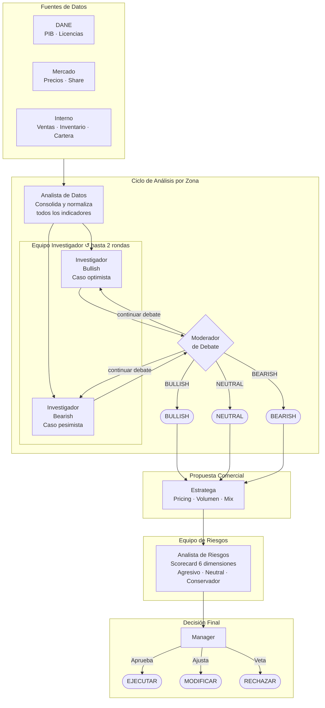

# Cement Sales Intelligence
### Sistema Multi-Agente de Inteligencia Comercial para el Mercado de Cemento en Colombia

Sistema LLM multi-agente que analiza el mercado de cemento por zona geográfica y genera recomendaciones estratégicas de pricing, mix de productos e inversión comercial, con análisis de riesgos integrado y decisión final del manager.

---

## Arquitectura



---

## Agentes

| Agente | Rol | Output |
|--------|-----|--------|
| **Analista de Datos** | Consolida DANE, SAP/ERP y precios de competencia | JSON con indicadores normalizados |
| **Investigador Bullish** | Construye el caso optimista con evidencia cuantitativa | Argumentos alcistas por zona |
| **Investigador Bearish** | Construye el caso pesimista con evidencia cuantitativa | Argumentos bajistas por zona |
| **Moderador de Debate** | Arbitra el debate y sintetiza la posición final | `BULLISH / BEARISH / NEUTRAL` + confianza |
| **Estratega** | Traduce el veredicto en estrategia comercial accionable | Propuesta de pricing, volumen y mix |
| **Analista de Riesgos** | Evalúa 6 dimensiones de riesgo y ajusta la propuesta | Scorecard de riesgo + propuesta ajustada |
| **Manager** | Autoriza, modifica o rechaza la propuesta final | `EJECUTAR / MODIFICAR / RECHAZAR` + acciones |

---

## Zonas Comerciales

| # | Zona | Ciudades principales |
|---|------|----------------------|
| 1 | Costa Caribe | Barranquilla, Cartagena, Santa Marta |
| 2 | Antioquia | Medellín, Valle de Aburrá |
| 3 | Centro | Bogotá, Cundinamarca |
| 4 | Sur | Cali, Valle del Cauca, Cauca |
| 5 | Eje Cafetero | Pereira, Manizales, Armenia |
| 6 | Santanderes | Bucaramanga, Cúcuta |
| 7 | Llanos | Villavicencio, Meta |

---

## Instalación

```bash
git clone <repo>
cd TradingAgents2
pip install -r requirements.txt
pip install langchain-anthropic langchain-openai langgraph python-dotenv
```

Copia el archivo de variables de entorno y agrega tu API key:

```bash
cp .env.example .env
```

Edita `.env` con el proveedor que vayas a usar:

```env
# Anthropic (Claude)
ANTHROPIC_API_KEY=sk-ant-...

# OpenAI (GPT)
OPENAI_API_KEY=sk-...
```

---

## Uso

### CLI

```bash
# Una zona con Anthropic (default)
python cement_main.py --zona "Sur" --perfil Agresivo

# Una zona con OpenAI
python cement_main.py --zona "Antioquia" --provider openai --perfil Conservador

# Todas las zonas — tabla resumen
python cement_main.py --all --perfil Neutral

# Todas las zonas con OpenAI
python cement_main.py --all --provider openai --perfil Neutral

# Con fecha específica
python cement_main.py --zona "Llanos" --fecha 2026-03-28
```

**Perfiles de riesgo:** `Agresivo` · `Neutral` · `Conservador`

**Providers soportados:** `anthropic` · `openai`

### Python

```python
from cementagents import CementAgentsGraph
from cementagents.graph.propagation import CementPropagator

graph = CementAgentsGraph()

# Analizar una zona
result = graph.analyze_zona("Sur", perfil_riesgo="Agresivo")
print(f"Veredicto: {result['veredicto']} ({result['confianza']:.0%})")
print(f"Decision:  {result['decision_final']}")
print(CementPropagator.format_report(result))

# Analizar todas las zonas
resultados = graph.analyze_all_zonas(perfil_riesgo="Neutral")
for zona, r in resultados.items():
    print(f"{zona}: {r['veredicto']} → {r['decision_final']}")
```

### Configuración avanzada

```python
from cementagents import CementAgentsGraph
from cementagents.default_config import DEFAULT_CONFIG

config = DEFAULT_CONFIG.copy()
config["llm_provider"] = "openai"          # anthropic | openai
config["deep_think_llm"] = "gpt-4o"        # modelo para debate, riesgos y manager
config["quick_think_llm"] = "gpt-4o-mini"  # modelo para analista e investigadores
config["max_debate_rounds"] = 3
config["max_risk_discuss_rounds"] = 2
config["risk_profile"] = "Conservador"
config["use_mock_data"] = True             # False para conectar datos reales

graph = CementAgentsGraph(config=config)
```

Ver [`cementagents/default_config.py`](cementagents/default_config.py) para todas las opciones.

---

## Modelos por proveedor

| Provider | Quick (analista / investigadores) | Deep (debate / riesgos / manager) |
|----------|-----------------------------------|-----------------------------------|
| `anthropic` | claude-sonnet-4-6 | claude-sonnet-4-6 |
| `openai` | gpt-4o-mini | gpt-4o |

---

## Estructura del proyecto

```
cementagents/
├── agents/
│   ├── analysts/
│   │   └── data_analyst.py          # Consolida DANE + SAP + competencia
│   ├── researchers/
│   │   ├── bull_researcher.py       # Investigador bullish
│   │   └── bear_researcher.py       # Investigador bearish
│   ├── debate/
│   │   └── debate_moderator.py      # Moderador y árbitro del debate
│   ├── strategist/
│   │   └── strategist.py            # Estratega comercial
│   ├── risk_mgmt/
│   │   └── risk_analyst.py          # Scorecard de riesgos (6 dimensiones)
│   ├── managers/
│   │   └── manager.py               # Decisión final
│   └── utils/
│       ├── agent_states.py          # ZonaState TypedDict (LangGraph)
│       └── memory.py                # Memoria de decisiones por zona
├── dataflows/
│   └── mock_data.py                 # Datos simulados 2026 — 7 zonas
├── graph/
│   ├── cement_graph.py              # Orquestador principal
│   ├── setup.py                     # Construcción del grafo LangGraph
│   ├── conditional_logic.py         # Routing condicional entre nodos
│   └── propagation.py               # Extracción y formato de resultados
├── schemas/
│   └── zona_schema.py               # Modelos Pydantic
└── default_config.py                # Configuración por defecto
cement_main.py                       # Entry point CLI (Typer + Rich)
.env.example                         # Template de variables de entorno
```

---

## Ejemplo de output

```
╭─────────────────────────────────────────────────────────╮
│  Cement Sales Intelligence System                       │
│  Argos Colombia | Fecha: 2026-03-28 | Perfil: Agresivo  │
│  Provider: openai                                       │
╰─────────────────────────────────────────────────────────╯

ZONA: Sur
━━━━━━━━━━━━━━━━━━━━━━━━━━━━━━━━━━━━━━━━━━━━━━━━━━━━━━━━
VEREDICTO:   BULLISH  (confianza: 82%)
DECISION:    EJECUTAR

Propuesta Estratega:
  Pricing:  Incrementar 3.5% — mercado aguanta diferencial
  Volumen:  Push clientes tier 1, constructor y ferretería
  Mix:      Priorizar cemento gris premium y morteros

Scorecard de Riesgos:
  Concentracion clientes  ░░░░░░░░░░  BAJO    3/10
  Guerra de precios       ░░░░░░░░░░  BAJO    2/10
  Inventario              ░░░░░░░░░░  BAJO    2/10
  Cartera vencida         ░░░░░░░░░░  BAJO    2/10
  Sensibilidad macro      ████░░░░░░  MEDIO   4/10
  RIESGO GLOBAL:          BAJO

Acciones autorizadas:
  1. Aplicar incremento de precio 3.5% a partir del 01-Apr
  2. Activar bonificacion por volumen para top 10 clientes
  3. Monitorear respuesta de Holcim en los proximos 15 dias
━━━━━━━━━━━━━━━━━━━━━━━━━━━━━━━━━━━━━━━━━━━━━━━━━━━━━━━━
```
